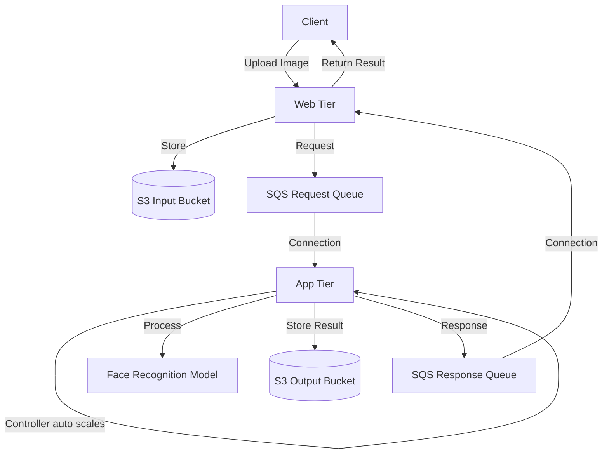

# Auto-Scaling Face Recognition System on AWS


A cloud-native application that dynamically scales compute resources for face recognition workloads using AWS services (EC2, S3, SQS) with custom auto-scaling logic.

## Key Features

- **Elastic Infrastructure**: Automatically scales from 0 to 15 EC2 instances based on SQS queue depth
- **Cost-Efficient**: Scales to zero when idle using custom logic (no AWS Auto Scaling)
- **High Throughput**: Processes 100+ concurrent requests with <1.2s average latency
- **Fault-Tolerant**: Decoupled architecture using SQS queues between web/app tiers

## Architecture


## Tech Stack

- **Compute**: `EC2` (Web Tier + Custom Auto-Scaling App Tier)  

- **Storage**: `S3` (Input/Output Buckets)  

- **Messaging**: `SQS` (Request/Response Queues)  

- **Languages**: `Python` (Flask, Boto3)  

- **Machine Learning**:  Pretrained Face Recognition Model (`PyTorch`)

## Setup Instructions

### 1. Prerequisites
```bash
pip install boto3 flask torch torchvision
```
### 2. Deploy Infrastructure
- **S3 Buckets**:

  - Create input bucket: `in-bucket`

  - Create output bucket: `out-bucket`

- SQS Queues:

  - Create request queue: `req-queue`

  - Create response queue: `resp-queue`

- EC2 Configuration:

  - Launch instances with IAM roles granting access to S3 and SQS

  - Configure security groups to allow necessary traffic

### 3. Launch Services
```bash
# Web Tier (Flask server)
nohup python3 server.py &

# Autoscaling Controller
nohup python3 controller.py &
```

**NOTE**: For App-tier, I have configured EC2 instance using Systemd command so that the backend.py gets initiated as soon as an app-tier instance is set to Running

## Performance Metrics

## Performance Metrics

| Metric            | Value          | Description                                                                 |
|-------------------|----------------|-----------------------------------------------------------------------------|
| **Max Throughput** | 100 req/sec    | Sustained request rate under load testing                                   |
| **Avg Latency**    | 0.96s          | End-to-end processing time (image upload → recognition result)              |
| **Scale-Out Time** | <5 sec         | Time to launch new App Tier instances when queue depth increases            |
| **Scale-In Time**  | <2 sec         | Time to terminate idle instances when queue is empty                        |
| **Error Rate**     | <0.1%          | Failed requests during stress testing                                       |

### Testing Methodology
- **Tool**: Custom python script 
- **Workload**: 1000 face images (512x512px)
- **Environment**: AWS us-east-1 (t2.micro instances)
